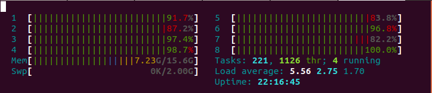

# ThreadPromises

Promises running in separated threads

```js
new TPromise((resolve) => {
  resolve("I am multithread JavaScript");
});
```

- [ThreadPromises](#threadpromises)
- [Usage](#usage)
  - [Simple](#simple)
  - [In async function](#in-async-function)
- [Installing](#installing)
    - [Or](#or)
    - [Or](#or-1)
- [Examples](#examples)

[](https://badge.fury.io/js/thread-promises)  

It creates a thread for every task so it not blocking main thread and it could run in parallel



# Usage

## Simple

```js
new TPromise((resolve, reject) => {
  console.log("I am multithread JavaScript");
});
```

## In async function

```js
const hugeAsyncOperation = () => {
  return new Promise((resolve) => {
    const time = new Date().getTime();
    while (new Date().getTime() - time < 10000) {}
    resolve();
  });
};

const hugeMultithreadOperation = () => {
  return new TPromise((resolve) => {
    const time = new Date().getTime();
    while (new Date().getTime() - time < 10000) {}
    resolve();
  });
};

(async () => {
  console.log("Start async");
  // We'll be blocked here. Page will not respond for 10 seconds
  await hugeAsyncOperation();
  console.log("Async done");

  console.log("Start multithread");
  // We'll not be blocked here. Page will act like nothing happens and continue here in 10 seconds
  await hugeMultithreadOperation();
  console.log("Multithread done");
})();
```

For additional properties put them after executor function (like in setTimeout):

```js
new TPromise(
  (resolve, reject, some, additional, properties) => {
    console.log(
      "I have no access to my old lexical environment, but I can use props"
    );
    console.log(some, additional, properties);
  },
  some,
  additional,
  properties
);
```

# Installing

```html
<script src="/lib/thread-promises.min.js"></script>
```

### Or

```html
<script src="https://cdn.jsdelivr.net/npm/thread-promises/lib/thread-promises.min.js"></script>
```

### Or

```bash
npm i --save thread-promises
```

```js
import TPromise from "thread-promises";
```

# Examples

[th-sort](https://github.com/kshshe/t-sort) is a simple non-blocking sorting library

[All examples](https://github.com/kshshe/ThreadPromises/tree/master/examples)

Expample of making blocking job on main thread and on TPromise's thread

[demo](http://htmlpreview.github.io/?https://github.com/kshshe/ThreadPromises/blob/master/examples/BlockingTask/index.html)
and [code](https://github.com/kshshe/ThreadPromises/tree/master/examples/BlockingTask)

Simple resolve on timeout

[demo](http://htmlpreview.github.io/?https://github.com/kshshe/ThreadPromises/blob/master/examples/simpleTimeout/index.html)
and [code](https://github.com/kshshe/ThreadPromises/tree/master/examples/simpleTimeout)

Simple reject on timeout

[demo](http://htmlpreview.github.io/?https://github.com/kshshe/ThreadPromises/blob/master/examples/simpleReject/index.html)
and [code](https://github.com/kshshe/ThreadPromises/tree/master/examples/simpleReject)
